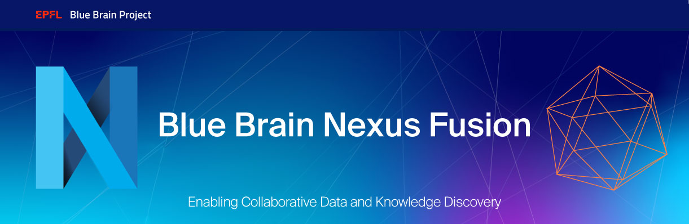

# Nexus Fusion plugins

This project contains Nexus Fusion Plugins that were originally developed for Blue Blrain and a development environment for them.

## Development

Dev environment can be started with:

```bash
$ make run_dev
```

## Build

Build consists of multiple stages:

- build ts sources into js bundles
- create a plugin manifest.json
- build a docker image to serve artifacts mentioned above

Can be started with:

```bash
$ make build_image
```

When calling this target all necessary dependencies will be managed by `make`.

[Makefile](Makefile) also contains targets corresponding to each separate build step.

For testing the plugins from within Fusion locally you can run the first two steps of
the build process above and then serve these files up using express to which you can
point your local Fusion instance at.

```bash
$ make build_dist_and_host
```

## Deployment

When docker image has been built it can be pushed into docker registry by invoking:

```bash
$ make push_image
```

Note that `push_image` target isn't dependent on `build_image`, so it will **push current version**
of the image present.

## Citation
 
When you use this software, we kindly ask you to cite the following publication:
 
[Sy, Mohameth François; Roman, Bogdan; Kerrien, Samuel; Mendez, Didac Montero; Genet, Henry; Wajerowicz, Wojciech; Dupont, Michaël; Lavriushev, Ian; Machon, Julien; Pirman, Kenneth; Neela Mana, Dhanesh; Stafeeva, Natalia; Kaufmann, Anna-Kristin; Lu, Huanxiang; Lurie, Jonathan; Fonta, Pierre-Alexandre; Martinez, Alejandra Garcia Rojas; Ulbrich, Alexander D.; Lindqvist, Carolina; Jimenez, Silvia; Rotenberg, David; Markram, Henry; Hill, Sean L. (2023). Blue Brain Nexus: An open, secure, scalable system for knowledge graph management and data-driven science. Semantic Web, 2023, Volume 14, Issue 4, p. 697-727 [https://doi.org/10.3233/sw-222974](https://content.iospress.com/articles/semantic-web/sw222974>).

## Funding & Acknowledgment

The development of this software was supported by funding to the Blue Brain Project, a research center of the École polytechnique fédérale de Lausanne (EPFL), from the Swiss government's ETH Board of the Swiss Federal Institutes of Technology.

Copyright © 2015-2024 Blue Brain Project/EPFL
